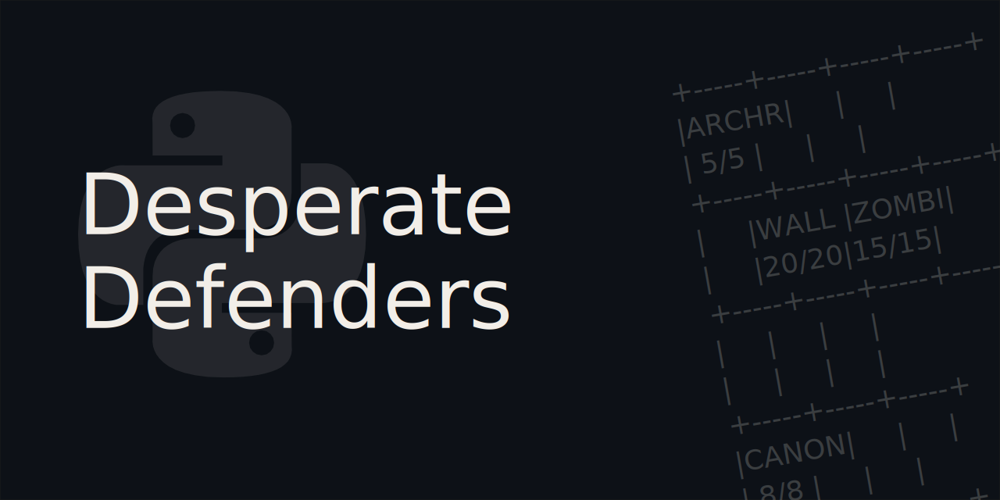

# desperate-defenders

Welcome to the project repository for my code for Desperate Defenders! This project is part of a project required by one of my modules in school.

## About the project

The following is lifted from the assignment brief for the project:

> **Background**
>
> Develop a tower defence game called Desperate Defenders.
>
> **Scope**
>
> Undead creatures are attacking the city! Position your units to protect the city until you have killed enough of the creatures to drive them off.
>
> In this “tower defence” strategy game, monsters are advancing on the city from right to left across 5 lanes. To kill the monsters, you have to purchase units and place them on the field of battle so that they can shoot or block the monsters. However, you start with 10 gold and only get 1 gold per turn, so spend your precious resources wisely!

This project is made in Python and contains all the code required in [main.py](https://github.com/arashnrim/desperate-defenders/blob/main/main.py).

## Contributing

This project is ***not* accepting major contributions** as it is mainly completed and meant for a school assignment. However, if there is an issue — like a spelling or grammatical error, a visual bug, or other kinds of weird things happening — please feel free to [create an issue](https://github.com/arashnrim/desperate-defenders/issues/new).

If you would like to leave comments about the source code — like possible design and code improvements, or other kinds of feedback — please feel free to [create an issue](https://github.com/arashnrim/desperate-defenders/issues/new) too if you wish!

## Licence

This repository is made open-source with the [MIT License](https://github.com/arashnrim/desperate-defenders/blob/main/LICENSE.md), meaning that you are allowed to modify and distribute the source code as well as use it for private and commercial use provided that the licence and copyright notices are retained. For more information, visit the link above to learn what is permitted by the licence.
